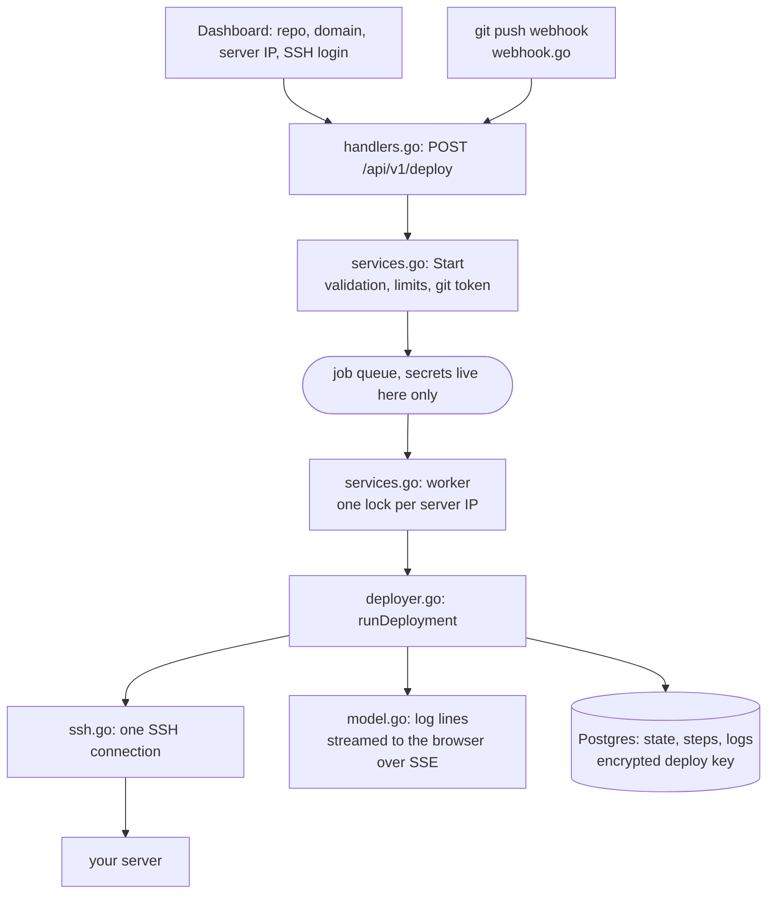
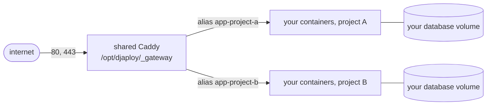

<p align="center">
  
</p>

<h1 align="center">djaploy core</h1>

<p align="center">The code that touches your server, opened up.</p>

<p align="center"><strong>English</strong> · <a href="./README.ru.md">Русский</a></p>

---

This is the DevOps half of [djaploy](https://djaploy.dev): the part that connects to your server,
prepares it, deploys your project, keeps HTTPS working, redeploys on a git push and cleans up after
itself when you leave.

You hand djaploy an SSH login to a machine you own. That is a lot of trust, and a promise in
marketing copy is worth very little next to the source. So here is the source: every command that
runs on your server comes from the files below, and this README says which file and which function
does what. Including the parts we are not proud of, near the bottom.

If you want the commands themselves without any Go around them, they are written out line by line
in [djaploy-scripts](https://github.com/slime4ik/djaploy-scripts). This repository is the machinery
that runs them.

## What is here and what is not

Included: the deploy engine, SSH, the shared Caddy gateway and HTTPS, the config templates, the
webhook handlers for auto deploy, disk and health monitoring, encryption of the keys we store, and
authentication (GitHub App, GitLab OAuth, JWT sessions).

Not included: billing and payments, referrals, the Telegram bot, teams, the admin panel and the
frontend. Those packages are the business, not the part you need to audit before giving out a root
password. The deploy engine talks to them through small interfaces you can see in
`internal/deploy/services.go` (`PlanLimiter`, `Notifier`, `TeamAccess`, `ReferralRewarder`), so the
seams are visible even though the implementations are not here.

This is a readable extract, not a runnable service: `cmd/server` and the database migrations stay
in the private repository. Everything here compiles and the tests pass:

```bash
go build ./...
go test ./...
```

One more thing worth knowing up front: log lines and error messages are in Russian, because the
product UI is Russian. Comments and docs are English. Nothing was reworded to look nicer here, the
code is the code that runs.

## Reading it without knowing Go

If Go is not your language, this is enough to follow along.

- `func Name(args) Result { ... }` is a function. `func (d *Deployer) clone(...)` is a function
  attached to a type, so read it as "the clone step of the deployer".
- A `struct` is a record with named fields, like a dict with a fixed shape.
- Errors are returned, not thrown. `if err != nil { return ... }` is the normal way to say "this
  failed, stop here". Our own error type is `DeployError` (in `model.go`): a machine code, a message
  for the user, and a hint on what to change.
- `ctx context.Context` carries a deadline. It is how a step gets cancelled when it takes too long.
- `go func() { ... }()` starts something in the background; `sync.Mutex` guards data two of those
  might touch at once.
- Long strings enclosed in backticks are shell scripts. That is the actual text sent over SSH, so
  you can read a deploy step as a bash script with a Go wrapper around it.

Start with `internal/deploy/deployer.go`. The function `runDeployment` is the whole deploy from top
to bottom, roughly one page, and every step below is one call from that list.

## How it fits together



What runs on your server after a deploy:



One Caddy per machine, everything else is yours. The gateway reaches your app over a shared docker
network, so your own compose networking is never edited.

## The deploy, step by step

`internal/deploy/services.go` → `Start` validates the request and puts a job in a queue; `worker`
picks it up; `internal/deploy/deployer.go` → `runDeployment` runs it. Web deploys onto the same
server are serialized with a per-IP lock, because they share one Caddy gateway.

| Step | Where | What happens on your server |
| --- | --- | --- |
| DNS | `deployer.go` → `checkDNS` | Resolves your domain and compares it with the server IP. No SSH yet. Without a correct A record Let's Encrypt cannot issue a certificate, so this fails early and says so. |
| Connect | `ssh.go` → `DialKey`/`DialPassword`, `hostkey.go` | One SSH connection. Normally on the key you granted yourself (see [Server access](#server-access)); a password is only the fallback for people the key did not work for. The server's host key is checked against the fingerprint recorded on the first connection, and a mismatch drops the connection before any credential is sent. If the login is not root we check that `sudo` works and escalate only where needed (`deployer.go` → `priv`). |
| Access key | `access.go`, `deployer.go` → `keepAccessKey` | On the normal path there is nothing to install: you added our line yourself, so we just remember that key for later redeploys and exactly one line of ours stays in `authorized_keys`. On the password fallback `deployer.go` → `installAccessKey` generates an ed25519 key and appends the public half itself. |
| Server prep | `deployer.go` → `prepareServer` | `apt-get update`, installs fail2ban (ban after 5 failed SSH attempts), opens 80 and 443 on the local firewall. |
| Docker | `deployer.go` → `ensureDocker` | Installs Docker if it is missing, writes registry mirrors into `/etc/docker/daemon.json`, waits out any background apt that holds the lock. |
| Clone | `deployer.go` → `clone` | Clones into `/opt/djaploy/<project>`. The token travels in `http.extraheader`, not in the URL and not in the deploy log (`deployer.go` → `gitAuth`). Requires a `docker-compose.yml` in the repo root. |
| .env | `deployer.go` → `writeEnv`, `templates.go` → `renderEnv` | Writes your `.env` straight to the server with mode 600 and appends `DOMAIN`. Django projects also get `ALLOWED_HOSTS`, `CSRF_TRUSTED_ORIGINS` and `DEBUG=False`; other stacks get nothing extra. |
| Caddy | `gateway.go` → `setupGateway` | Brings up the shared Caddy gateway and writes this site's snippet. See [multi-site](#https-and-the-multi-site-gateway) below. |
| Build and start | `deployer.go` → `composeUp` | `docker compose up -d --build`, then `gateway.go` → `connectGateway` attaches the app container to the gateway network under the alias `app-<project>`. |
| Django (optional) | `deployer.go` → `djangoTasks` | `migrate` and `collectstatic` on every deploy. `makemigrations` is deliberately never run on the server; the comment above the function explains why at length. |
| Health | `deployer.go` → `health` | Polls `https://<domain>/` for about two minutes, hitting the server IP directly with the right SNI. Recognizes a Let's Encrypt rate limit and says so instead of blaming your ports. |
| Superuser (optional) | `deployer.go` → `createSuperuser` | `createsuperuser --noinput` with credentials from the form. Soft step: it cannot fail the deploy. |
| VPN (optional) | `deployer.go` → `provisionVPN` | AmneziaWG (WireGuard with obfuscation), one tunnel per server, client config written to `.djaploy/wg-client.conf` on your machine. Soft step. |
| Non-root (optional) | `deployer.go` → `handoverNonRoot` | Creates a `deploy` user in the docker group, hands the project over and switches future deploys to it. Your root access is left exactly as it was. Soft step. |

A "soft" step never fails the deploy: the project is already running, so a failure is reported as a
warning and the deploy continues. Every step has its own timeout, and the whole job has one of 40
minutes (`services.go` → `worker`).

## Updating, rolling back, auto deploy

`internal/deploy/redeploy.go` holds both short cycles. They connect with the stored key, so no
password is involved.

- `runRedeploy`: `pull` (fetch and hard reset, which leaves untracked files such as `.env` alone),
  regenerate the Caddy snippet, rebuild, run the Django tasks, health check.
- `runRollback`: check out one specific commit from the release history and rebuild. Volumes and
  `.env` are untouched, so your data stays where it is. The history is a stack of the last ten
  deployed commits kept in `ServerState.Releases` (`deployer.go` → `recordRelease`).

Auto deploy on push lives in `internal/deploy/webhook.go`. GitHub is verified by HMAC-SHA256
(`validSignature`, and an empty secret rejects everything rather than trusting everyone). GitLab has
no HMAC, so each project gets a deterministic secret derived from the deploy id
(`services.go` → `GitLabHookSecret`) which you paste into the GitLab webhook settings. Only a push
to the default branch triggers anything; branch deletions and other events are ignored.

## HTTPS and the multi-site gateway

One Caddy per server, in `/opt/djaploy/_gateway`, holding ports 80 and 443 and issuing every
certificate. Each site is one file, `sites/<project>.caddy`, and the root Caddyfile just imports
them. Adding or changing a site is a file write plus `caddy reload`, which is why deploying one
project never interrupts its neighbours.

Code: `internal/deploy/gateway.go` for the lifecycle, `internal/deploy/templates.go` for the files
it writes. Details in [docs/multisite.md](./docs/multisite.md).

Two things the templates do that are easy to miss:

- Security headers (HSTS, nosniff, SAMEORIGIN, referrer policy, no `Server` banner) go on every
  site by default: `templates.go` → `gwSecHeaders`.
- During a rebuild Caddy holds requests and retries the upstream for up to 30 seconds
  (`lb_try_duration`) instead of answering 502, so a redeploy looks like a slow page rather than an
  error.

Path protection (`templates.go` → `gwPathGuard`) is how `/admin` and friends get closed off: the
listed paths answer 404 for everyone except trusted IPs, where trusted means the VPN subnet
`10.8.0.0/24` and any addresses you added. If there is nothing trusted, no guard is written at all,
because locking a path for literally everyone including you is worse than leaving it open.

## Server access

We do not ask for your server password. `access.go` generates an ed25519 pair on our side and shows
you one line plus the command that puts it into your own `~/.ssh/authorized_keys`. The public half
goes to your server, the private half is encrypted and stored with us, so a copy of that line is
useless to anyone who finds it: it is the lock, not the key.

| What | Where | Detail |
| --- | --- | --- |
| Issue a key | `access.go` → `EnsureAccess` | One key per server plus ssh user, not per project. A second project on the same server reuses it, so only one line of ours ever sits in `authorized_keys`. We never reissue: the line you already added would quietly become junk. |
| The line itself | `access.go` → `installOnServer`, `installCommand` | Ends with the comment `djaploy-xxxxxxxx`. That label is how you find it by eye, and what the revoke command matches on. |
| Check | `access.go` → `CheckAccess` | We try the key and also look at what rights we get (root or passwordless sudo), so you learn about a problem here and not halfway through a deploy. |
| Revoke | `access.go` → `RevokeAccess`, `revokeOnServer` | `sed -i "/djaploy-xxxxxxxx/d" ~/.ssh/authorized_keys`, from the dashboard or by hand. We also destroy our half of the key, and we verify the line is really gone instead of reporting success blindly. |
| Which key connects | `access.go` → `accessKeyPEM` | Keys we know work come first. A granted but never-installed key used to shadow a working team key and break deploys, so the order is deliberate. |

What the key can do on your server is whatever your ssh user can do, including `docker`, and docker
is effectively root. That is what makes a deploy possible at all, and it is why the revoke is one
line you control rather than a promise from us.

## What we change outside your project folder

Your project lives in `/opt/djaploy/<project>`. Everything else we touch is listed here, so nothing
is a surprise. Optional rows only happen if you asked for that feature.

| Path or system state | When | What we do |
| --- | --- | --- |
| `apt` packages | every deploy | Install `fail2ban curl ca-certificates git`, with `--force-confnew`, which means a package config file we install replaces yours. |
| `/etc/fail2ban/jail.local` | every deploy | Overwritten with an `[sshd]` jail: 5 retries, 1 hour ban. |
| Docker itself | first deploy | Installed with the official script from `get.docker.com` if `docker` is missing. |
| `/etc/docker/daemon.json` | every deploy | **Overwritten**, not merged: registry mirrors, `userland-proxy: false`, DNS 8.8.8.8 and 1.1.1.1. If you keep custom daemon settings there, back them up. |
| `ufw` | every deploy | `allow 80/tcp` and `allow 443/tcp` if ufw is installed. Your cloud firewall is separate and we cannot touch it. |
| `~/.ssh/authorized_keys` | you add it, or the password fallback | Normally you paste our line yourself and can take it off with one command, the same one the dashboard shows. On the password fallback we append the line during the first deploy. A full delete removes it again. |
| `/opt/djaploy/_gateway` | first web deploy | The shared Caddy stack: compose file, root Caddyfile, one snippet per site, Let's Encrypt data volume. |
| docker network `djaploy` | first web deploy | Created, and your app container is attached to it by alias. Your own compose networks are untouched. |
| `/etc/amnezia/amneziawg`, `/etc/sysctl.d/99-djaploy-wg.conf`, iptables, `awg-quick@awg0` | VPN only | AmneziaWG from the Amnezia PPA as a DKMS module, kernel headers installed, `ip_forward` enabled, one UDP port opened, NAT and FORWARD rules added. We also normalize the PPA codename to `noble` when your release has no packages there. |
| `useradd deploy`, `usermod -aG docker` | non-root only | A new user in the docker group, owning the project folder. |

After a full delete with purge (`services.go` → `Delete`) we remove the containers, the volumes, the
images we built, the project folder, the gateway snippet, the VPN and our SSH key. What stays behind:
Docker itself, the rewritten `daemon.json`, fail2ban and its jail, the packages we installed, the
Amnezia PPA, and the `deploy` user if you asked for one. "As if we were never here" is true for your
project, not for the base system.

## Secrets and what we keep

| Secret | Where it lives |
| --- | --- |
| Your SSH password | In memory, inside the `job` struct, for the length of one deploy. Never written to the database. See the comment on `job` in `services.go`. |
| Your `.env` | Written straight to your server. Never stored on our side. |
| GitHub installation token | Short lived, minted per operation, cached in Redis, never in the database. |
| GitLab OAuth token | Encrypted with AES-256-GCM and stored, because the refresh cycle needs it. Read only scopes. |
| The deploy SSH key we generate | Private half encrypted with AES-256-GCM and stored, so redeploys work without you. |

Encryption is `internal/crypto/secretbox.go` for OAuth tokens and `internal/deploy/keys.go` for SSH
keys: the same AES-256-GCM scheme with different key derivation salts, so the two key spaces cannot
be confused. Both keys are derived from the server JWT secret, so no extra environment variable has
to be managed.

Other guards worth pointing at:

- Host key pinning: the fingerprint of your server is recorded on the first deploy
  (`server_host_keys`, one row per user and IP) and verified on every connection afterwards. If you
  rebuild the server, one button in the dashboard forgets it and the next deploy records the new
  one (`services.go` → `ResetHostKey`).
- SSRF: a deploy target has to be a publicly routable IP. Loopback, private ranges and the cloud
  metadata range are rejected (`services.go` → `isPublicIP`).
- One repository maps to one project per server, and one domain to one site, both checked before
  anything is touched (`repo.go` → `RepoOnServer`, `DomainInUse`). Without that, a second deploy of
  the same repository would overwrite the first one's directory and containers.
- Full removal actually removes: `services.go` → `Delete` with `purge` runs
  `docker compose down -v --rmi local`, deletes the project folder, tears the VPN down, drops our
  key out of `authorized_keys` and takes the site out of the gateway. Without `purge`, containers
  stop and the data stays.

## Authentication

`internal/auth` is the sign-in half: GitHub OAuth plus a GitHub App for repository access, GitLab
OAuth as a second provider, and either one can be attached to an existing profile (the `link_uid`
cookie is what tells a callback "this is a link, not a login").

Sessions are JWT in httpOnly cookies: access for 15 minutes, refresh for 30 days
(`auth/services.go` → `GenerateTokens`). The middleware verifies the signing method explicitly,
which is what stops `alg:none` and algorithm substitution (`internal/middleware/jwt.go`). A banned
account is stopped in `auth/middleware.go` → `RequireActive`, which fails open on a database error
so an outage cannot sign everyone out.

GitLab is deliberately read only (`read_user read_api read_repository`): we do not hold a token that
can write to your code, which is also why the CD webhook for GitLab has to be added by hand.

## Known limitations

Publishing the code only means something if the awkward parts come with it. Here is what we would
raise ourselves in a review, roughly worst first.

- **Host key verification is trust on first use.** The first connection records your server's
  fingerprint (`hostkey.go`) and every later one is checked against it, but that very first
  connection has nothing to compare against. Someone already sitting in the middle at that exact
  moment would be recorded as the real server. Every connection after it is protected, and a
  mismatch drops the connection before your password is sent.
- **The git token appears in a process argument on your own server.** It goes into a
  `git -c http.extraheader=...` argument. It is not in our logs and not in the URL, but anyone who
  can run `ps` on your server at that moment can read it. On a single-admin VPS that is nobody;
  on a shared box it is a real leak. The same used to be true of the sudo password: on the key path
  there is no password at all (`sudo -n`), and it only applies to the password fallback.
- **`/etc/docker/daemon.json` is overwritten rather than merged.** If you had custom daemon options,
  they are gone after a deploy.
- **The non-root deploy user is in the docker group**, which on any Linux box is equivalent to root.
  It is an improvement over deploying as root, not a sandbox.
- **Staging through `/tmp`.** When the login is not root, files are written to a predictable
  `/tmp/.djaploy_<nanos>` path first and then moved with sudo. On a machine with untrusted local
  users that is a symlink race waiting to happen.
- **Refresh tokens cannot be revoked.** They carry a unique `jti` but nothing stores it, so signing
  out clears cookies without invalidating a stolen token for its 30 days. A ban does stop it.
- **One secret protects two things.** `JWT_SECRET` derives both the session signing key and the key
  that encrypts stored SSH and OAuth secrets. Separate secrets would limit the blast radius.
- **Your build runs arbitrary code, by design.** `docker compose up --build` executes your
  Dockerfile on your machine. That is the whole product, but it means a compromised dependency in
  your project is a compromised server, and nothing here prevents that.
- **Some names are misspelled** in code that predates the cleanup: `RedisAdress`, `GitHunAppID`,
  the `REDIS_ADRESS` environment variable. Renaming them is a coordinated change across the private
  service, so they are still here rather than quietly fixed in the mirror.

## Repository layout

```
internal/deploy/      the deploy engine
  deployer.go         the full deploy cycle and every step
  access.go           granting, checking and revoking server access
  redeploy.go         update and rollback
  gateway.go          the shared Caddy gateway lifecycle
  templates.go        Caddyfile, compose overlay, .env, monitoring configs
  services.go         queue, access checks, redeploy/rollback/delete, validation
  handlers.go         the HTTP API
  webhook.go          auto deploy on push (GitHub, GitLab)
  model.go            the deploy state, steps, log lines, errors
  repo.go             persistence in Postgres
  ssh.go              the SSH client, streaming command output
  keys.go             key generation and AES-256-GCM
  stats.go            disk, memory, containers on request
  diskmon.go          background disk alerts
  maintenance.go      maintenance mode and draining
  activity.go         the activity feed: events, the day grid, one day's detail
internal/auth/        sign-in, GitHub App, GitLab OAuth, sessions
internal/crypto/      AES-256-GCM for stored secrets
internal/github/      installation tokens
internal/gitlab/      OAuth and API v4 client
internal/cfg/         configuration from the environment
internal/middleware/  JWT verification
internal/ratelimit/   flood protection
internal/store/       Redis cache
docs/multisite.md     how several sites share one server
```

## Found something?

If you spot a real problem in this code, especially a security one, write to hi@djaploy.dev. That
is the whole point of publishing it.
