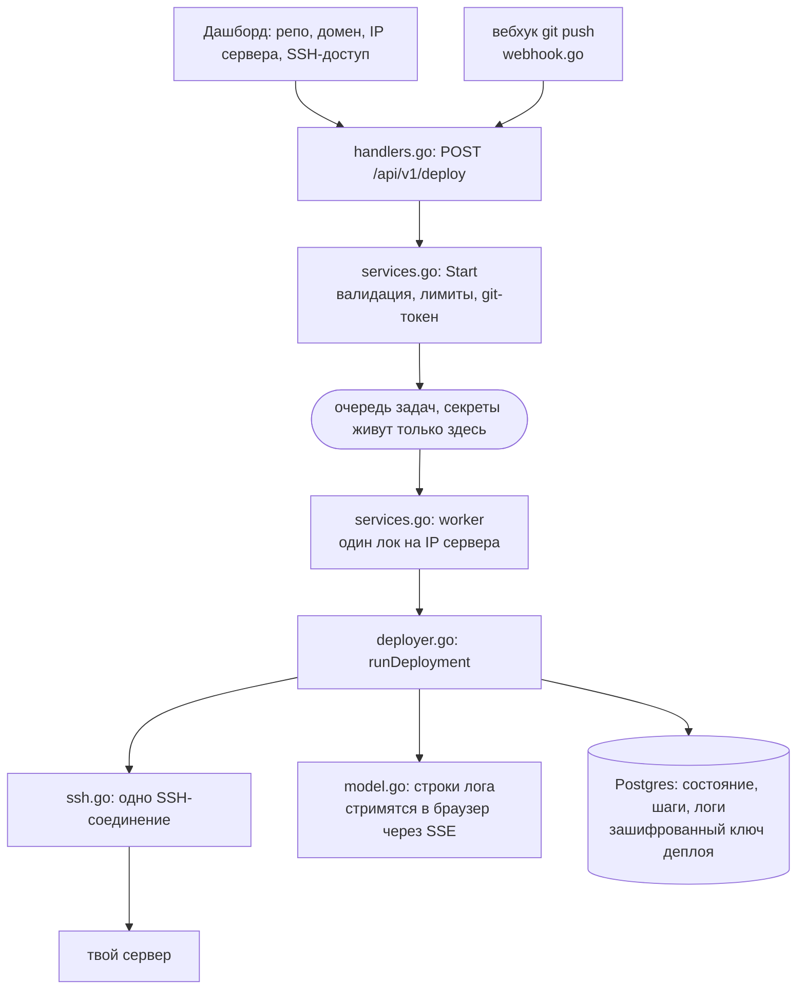
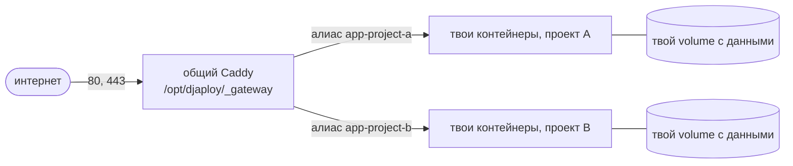

<p align="center">
  
</p>

<h1 align="center">djaploy core</h1>

<p align="center">Открытый код всего, что трогает твой сервер.</p>

<p align="center"><a href="./README.md">English</a> · <strong>Русский</strong></p>

---

Это девопс-половина [djaploy](https://djaploy.dev): то, что подключается к твоему серверу, готовит
его, разворачивает проект, держит HTTPS, обновляет по git push и убирает за собой, если ты уходишь.

Ты даёшь djaploy SSH-доступ к своей машине. Это большой кредит доверия, и обещания в маркетинге
рядом с исходниками ничего не стоят. Поэтому вот исходники: каждая команда, которая выполняется на
твоём сервере, лежит в файлах ниже, а этот README говорит, какой файл и какая функция за что
отвечает. Включая то, чем мы не гордимся, ближе к концу.

Если нужны сами команды без Go вокруг них, они выписаны построчно в отдельном репозитории
[djaploy-scripts](https://github.com/slime4ik/djaploy-scripts). Здесь лежит механика, которая их
запускает.

## Что тут есть и чего нет

Есть: движок деплоя, SSH, общий Caddy-шлюз и HTTPS, шаблоны конфигов, вебхуки авто-деплоя,
мониторинг диска и здоровья, шифрование ключей, которые мы храним, и авторизация (GitHub App,
GitLab OAuth, JWT-сессии).

Нет: биллинга и платежей, рефералки, телеграм-бота, команд, админки и фронта. Эти пакеты про
бизнес, а не про то, что нужно проверить перед выдачей рутового пароля. Движок деплоя общается с
ними через небольшие интерфейсы, они видны в `internal/deploy/services.go` (`PlanLimiter`,
`Notifier`, `TeamAccess`, `ReferralRewarder`), так что швы на месте, даже если реализаций тут нет.

Это читаемая выжимка, а не готовый сервис: `cmd/server` и миграции БД остались в приватном
репозитории. Всё, что тут лежит, собирается, тесты проходят:

```bash
go build ./...
go test ./...
```

Ещё одно: строки логов и тексты ошибок на русском, потому что интерфейс продукта русский.
Комментарии и документация на английском. Ничего не переписывали, чтобы выглядело красивее, код
здесь ровно тот, который работает.

## Как читать, если ты не пишешь на Go

Этого хватит, чтобы разобраться.

- `func Name(args) Result { ... }` это функция. `func (d *Deployer) clone(...)` это функция,
  привязанная к типу, читай как «шаг clone у деплойера».
- `struct` это запись с именованными полями, что-то вроде словаря фиксированной формы.
- Ошибки возвращаются, а не бросаются. `if err != nil { return ... }` это обычный способ сказать
  «не получилось, дальше не идём». Свой тип ошибки у нас `DeployError` (в `model.go`): машинный код,
  текст для юзера и подсказка, что менять.
- `ctx context.Context` носит с собой дедлайн. Через него шаг отваливается, если тянется слишком
  долго.
- `go func() { ... }()` запускает что-то в фоне, `sync.Mutex` защищает данные, к которым такие
  фоновые куски могут полезть одновременно.
- Длинные строки в обратных кавычках это шелл-скрипты. Ровно этот текст уходит по SSH, так что шаг
  деплоя можно читать как bash с обёрткой на Go.

Начинать удобно с `internal/deploy/deployer.go`. Функция `runDeployment` это весь деплой сверху
донизу, примерно на страницу, и каждый шаг ниже это один вызов из её списка.

## Как всё устроено



Что работает на сервере после деплоя:



Один Caddy на машину, всё остальное твоё. Шлюз достаёт приложение по общей docker-сети, твой
собственный networking в compose при этом не правится.

## Деплой по шагам

`internal/deploy/services.go` → `Start` проверяет запрос и кладёт задачу в очередь, `worker` её
забирает, `internal/deploy/deployer.go` → `runDeployment` выполняет. Веб-деплои на один и тот же
сервер идут по очереди, под локом по IP, потому что у них общий Caddy-шлюз.

| Шаг | Где | Что происходит на сервере |
| --- | --- | --- |
| DNS | `deployer.go` → `checkDNS` | Резолвим домен и сверяем с IP сервера, ещё до SSH. Без правильной A-записи Let's Encrypt не выдаст сертификат, поэтому падаем сразу и говорим об этом. |
| Подключение | `ssh.go` → `DialKey`/`DialPassword`, `hostkey.go` | Одно SSH-соединение. Обычно по ключу, который ты выдал сам (см. [Доступ к серверу](#доступ-к-серверу)); пароль остался запасным путём для тех, кому ключ не подошёл. Ключ хоста сверяется с отпечатком, записанным при первом подключении: расхождение рвёт соединение до того, как уйдёт хоть что-то. Если вход не под root, проверяем `sudo` и поднимаем права только там, где надо (`deployer.go` → `priv`). |
| Ключ доступа | `access.go`, `deployer.go` → `keepAccessKey` | На обычном пути ставить нечего: строку ты добавил сам, мы просто запоминаем этот ключ для будущих обновлений, и наша строка в `authorized_keys` остаётся ровно одна. На запасном пути по паролю `deployer.go` → `installAccessKey` генерит ed25519-ключ и дописывает публичную половину сам. |
| Подготовка | `deployer.go` → `prepareServer` | `apt-get update`, ставим fail2ban (бан после 5 неудачных попыток SSH), открываем 80 и 443 на локальном фаерволе. |
| Docker | `deployer.go` → `ensureDocker` | Ставим Docker, если его нет, прописываем зеркала реестра в `/etc/docker/daemon.json`, ждём фоновый apt, если он держит замок. |
| Клон | `deployer.go` → `clone` | Клонируем в `/opt/djaploy/<проект>`. Токен уходит в `http.extraheader`, не в URL и не в лог деплоя (`deployer.go` → `gitAuth`). В корне репозитория нужен `docker-compose.yml`. |
| .env | `deployer.go` → `writeEnv`, `templates.go` → `renderEnv` | Пишем твой `.env` прямо на сервер с правами 600 и дописываем `DOMAIN`. Django-проекты получают ещё `ALLOWED_HOSTS`, `CSRF_TRUSTED_ORIGINS` и `DEBUG=False`, остальные стеки не получают ничего лишнего. |
| Caddy | `gateway.go` → `setupGateway` | Поднимаем общий Caddy-шлюз и пишем сниппет этого сайта. Подробности ниже, в разделе про мульти-сайт. |
| Сборка и запуск | `deployer.go` → `composeUp` | `docker compose up -d --build`, затем `gateway.go` → `connectGateway` подключает контейнер приложения к сети шлюза под алиасом `app-<проект>`. |
| Django (опц.) | `deployer.go` → `djangoTasks` | `migrate` и `collectstatic` на каждом деплое. `makemigrations` на сервере не запускается никогда, причины расписаны в комментарии над функцией. |
| Проверка | `deployer.go` → `health` | Около двух минут стучимся в `https://<домен>/`, напрямую по IP сервера и с правильным SNI. Отдельно распознаём лимит Let's Encrypt, чтобы не сваливать вину на порты. |
| Суперпользователь (опц.) | `deployer.go` → `createSuperuser` | `createsuperuser --noinput` с данными из формы. Мягкий шаг, деплой не роняет. |
| VPN (опц.) | `deployer.go` → `provisionVPN` | AmneziaWG (WireGuard с обфускацией), один туннель на сервер, клиентский конфиг в `.djaploy/wg-client.conf`. Мягкий шаг. |
| Отдельный пользователь (опц.) | `deployer.go` → `handoverNonRoot` | Создаём юзера `deploy` в docker-группе, передаём ему проект и переключаем на него будущие деплои. Твой root-доступ остаётся ровно таким, каким был. Мягкий шаг. |

Мягкий шаг не роняет деплой: проект уже работает, поэтому ошибка превращается в предупреждение, а
деплой идёт дальше. У каждого шага свой таймаут, у всей задачи общий, 40 минут
(`services.go` → `worker`).

## Обновление, откат, авто-деплой

`internal/deploy/redeploy.go` держит оба коротких цикла. Оба подключаются по сохранённому ключу, без
пароля.

- `runRedeploy`: `pull` (fetch плюс hard reset, untracked-файлы вроде `.env` не трогает),
  перегенерация сниппета Caddy, пересборка, Django-задачи, health-check.
- `runRollback`: чекаутим конкретный коммит из истории релизов и пересобираем. Volume'ы и `.env` не
  трогаем, данные остаются на месте. История это стек последних десяти задеплоенных коммитов в
  `ServerState.Releases` (`deployer.go` → `recordRelease`).

Авто-деплой по push лежит в `internal/deploy/webhook.go`. GitHub проверяется по HMAC-SHA256
(`validSignature`, причём пустой секрет отклоняет всё, а не доверяет всем). У GitLab HMAC нет,
поэтому у каждого проекта свой детерминированный секрет от id деплоя
(`services.go` → `GitLabHookSecret`), его ты вставляешь в настройки вебхука. Реагируем только на
push в дефолтную ветку, удаления веток и прочие события игнорируем.

## HTTPS и мульти-сайт

Один Caddy на сервер, в `/opt/djaploy/_gateway`, держит порты 80 и 443 и выпускает все сертификаты.
Каждый сайт это отдельный файл `sites/<проект>.caddy`, а корневой Caddyfile просто импортирует их.
Добавить или поменять сайт значит записать файл и сделать `caddy reload`, поэтому деплой одного
проекта не мешает соседям.

Код: `internal/deploy/gateway.go` про жизненный цикл, `internal/deploy/templates.go` про файлы,
которые он пишет. Подробнее в [docs/multisite.md](./docs/multisite.md).

Две вещи в шаблонах, которые легко не заметить:

- Security-заголовки (HSTS, nosniff, SAMEORIGIN, referrer-policy, скрытый `Server`) включены на
  каждом сайте по умолчанию: `templates.go` → `gwSecHeaders`.
- Во время пересборки Caddy придерживает запрос и ретраит апстрим до 30 секунд
  (`lb_try_duration`), а не отдаёт 502. Редеплой выглядит как чуть более долгая загрузка, а не как
  ошибка.

Защита путей (`templates.go` → `gwPathGuard`) это то, чем закрываются `/admin` и подобное:
перечисленные пути отдают 404 всем, кроме доверенных адресов. Доверенные это подсеть VPN
`10.8.0.0/24` и те IP, которые ты добавил сам. Если доверенных нет вообще, защита не пишется:
закрыть путь для всех, включая себя, хуже, чем оставить его открытым.

## Доступ к серверу

Пароль от сервера мы не спрашиваем. `access.go` генерит пару ed25519 у нас и показывает тебе одну
строку плюс команду, которой ты кладёшь её себе в `~/.ssh/authorized_keys`. На сервер уезжает
публичная половина, приватная лежит у нас в зашифрованном виде. Поэтому копия этой строки никому
ничего не даёт: это замок, а не ключ.

| Что | Где | Подробность |
| --- | --- | --- |
| Выдать ключ | `access.go` → `EnsureAccess` | Один ключ на пару сервер и ssh-юзер, а не на проект. Второй проект на том же сервере переиспользует его, поэтому наша строка в `authorized_keys` всегда одна. Не перевыпускаем: строка, которую ты уже добавил, тихо стала бы мусором. |
| Сама строка | `access.go` → `installOnServer`, `installCommand` | В конце комментарий `djaploy-xxxxxxxx`. По этой метке ты находишь строку глазами, по ней же бьёт команда отзыва. |
| Проверка | `access.go` → `CheckAccess` | Пробуем зайти по ключу и заодно смотрим права (root или sudo без пароля), чтобы ты узнал о проблеме здесь, а не на середине деплоя. |
| Отзыв | `access.go` → `RevokeAccess`, `revokeOnServer` | `sed -i "/djaploy-xxxxxxxx/d" ~/.ssh/authorized_keys`, кнопкой или руками. Свою половину ключа мы уничтожаем, а факт удаления строки проверяем, а не рапортуем вслепую. |
| Каким ключом заходим | `access.go` → `accessKeyPEM` | Сначала те ключи, про которые мы знаем, что они работают. Выданный, но так и не добавленный ключ однажды перекрыл рабочий командный и ломал деплой, поэтому порядок продуман. |

Что этот ключ может на сервере: всё, что может твой ssh-пользователь, включая `docker`, а docker
это фактически root. Без этого деплой невозможен, и именно поэтому отзыв сделан одной строкой,
которая в твоих руках, а не обещанием с нашей стороны.

## Что мы меняем за пределами папки проекта

Твой проект живёт в `/opt/djaploy/<проект>`. Всё остальное, чего мы касаемся, перечислено здесь,
чтобы сюрпризов не было. Опциональные строки срабатывают, только если ты сам включил эту фичу.

| Путь или системное состояние | Когда | Что делаем |
| --- | --- | --- |
| Пакеты `apt` | каждый деплой | Ставим `fail2ban curl ca-certificates git`, с флагом `--force-confnew`, то есть конфиг пакета из дистрибутива заменит твой. |
| `/etc/fail2ban/jail.local` | каждый деплой | Перезаписываем: джейл `[sshd]`, 5 попыток, бан на час. |
| Сам Docker | первый деплой | Ставим официальным скриптом с `get.docker.com`, если `docker` не найден. |
| `/etc/docker/daemon.json` | каждый деплой | **Перезаписываем целиком**, без слияния: зеркала реестра, `userland-proxy: false`, DNS 8.8.8.8 и 1.1.1.1. Если у тебя там свои настройки демона, сохрани их заранее. |
| `ufw` | каждый деплой | `allow 80/tcp` и `allow 443/tcp`, если ufw установлен. Облачный фаервол это отдельная история, до него мы не дотягиваемся. |
| `~/.ssh/authorized_keys` | ты добавляешь сам, либо запасной путь по паролю | Обычно строку вставляешь ты и снимаешь одной командой, той же, что показывает панель. На запасном пути мы дописываем её при первом деплое. Полное удаление проекта её тоже убирает. |
| `/opt/djaploy/_gateway` | первый веб-деплой | Общий Caddy-стек: compose, корневой Caddyfile, по сниппету на сайт, volume с сертификатами Let's Encrypt. |
| docker-сеть `djaploy` | первый веб-деплой | Создаём и подключаем к ней контейнер приложения по алиасу. Твои собственные сети в compose не трогаем. |
| `/etc/amnezia/amneziawg`, `/etc/sysctl.d/99-djaploy-wg.conf`, iptables, `awg-quick@awg0` | только VPN | AmneziaWG из PPA Amnezia как DKMS-модуль, ставим заголовки ядра, включаем `ip_forward`, открываем один UDP-порт, добавляем правила NAT и FORWARD. Ещё нормализуем кодовое имя в PPA на `noble`, если под твой релиз пакетов нет. |
| `useradd deploy`, `usermod -aG docker` | только non-root | Новый пользователь в docker-группе, ему же переходит владение папкой проекта. |

После полного удаления с purge (`services.go` → `Delete`) мы сносим контейнеры, volume'ы, собранные
образы, папку проекта, сниппет в шлюзе, VPN и наш SSH-ключ. Остаётся: сам Docker, переписанный
`daemon.json`, fail2ban со своим джейлом, установленные пакеты, PPA Amnezia и пользователь `deploy`,
если ты его заказывал. «Как будто нас и не было» верно про твой проект, но не про базовую систему.

## Секреты и что мы храним

| Секрет | Где живёт |
| --- | --- |
| Твой SSH-пароль | В памяти, внутри структуры `job`, на время одного деплоя. В базу не попадает, см. комментарий к `job` в `services.go`. |
| Твой `.env` | Пишется прямо на твой сервер. У нас не хранится. |
| Installation-токен GitHub | Короткоживущий, выпускается под операцию, кэшируется в Redis, в базе его нет. |
| OAuth-токен GitLab | Хранится зашифрованным AES-256-GCM, потому что нужен цикл refresh. Скоупы только на чтение. |
| Наш сгенерированный SSH-ключ деплоя | Приватная половина шифруется AES-256-GCM и хранится, чтобы редеплой работал без тебя. |

Шифрование: `internal/crypto/secretbox.go` для OAuth-токенов и `internal/deploy/keys.go` для
SSH-ключей. Схема одна и та же, AES-256-GCM, но соли деривации разные, поэтому ключи не пересекутся.
Оба ключа выводятся из JWT-секрета сервера, отдельную переменную окружения вести не нужно.

Что ещё стоит посмотреть:

- Ключ хоста закрепляется: отпечаток сервера записывается на первом деплое (`server_host_keys`,
  строка на пару юзер+IP) и сверяется при каждом следующем подключении. Пересоздал сервер, нажал
  одну кнопку в дашборде, следующий деплой запомнил новый (`services.go` → `ResetHostKey`).
- SSRF: цель деплоя обязана быть публичным маршрутизируемым IP. Loopback, приватные диапазоны и
  адрес облачной метадаты отклоняются (`services.go` → `isPublicIP`).
- Один репозиторий это один проект на сервере, один домен это один сайт. Проверяется до того, как
  что-то трогаем (`repo.go` → `RepoOnServer`, `DomainInUse`). Иначе второй деплой того же репо
  затёр бы папку и контейнеры первого.
- Полное удаление действительно удаляет: `services.go` → `Delete` с `purge` делает
  `docker compose down -v --rmi local`, сносит папку проекта, гасит VPN, убирает наш ключ из
  `authorized_keys` и снимает сайт со шлюза. Без `purge` контейнеры просто останавливаются, данные
  остаются.

## Авторизация

`internal/auth` отвечает за вход: GitHub OAuth плюс GitHub App для доступа к репозиториям, GitLab
OAuth как второй провайдер, и любой из них можно прицепить к существующему профилю (кука `link_uid`
говорит колбэку, что это привязка, а не логин).

Сессии это JWT в httpOnly-куках: access на 15 минут, refresh на 30 дней
(`auth/services.go` → `GenerateTokens`). Middleware явно проверяет метод подписи, это закрывает
`alg:none` и подмену алгоритма (`internal/middleware/jwt.go`). Забаненный аккаунт останавливается в
`auth/middleware.go` → `RequireActive`, причём при ошибке базы он пропускает запрос, чтобы сбой БД
не вылогинил всех сразу.

GitLab подключён намеренно только на чтение (`read_user read_api read_repository`): токена с правом
записи в твой код у нас нет. Поэтому же CD-вебхук для GitLab добавляется руками.

## Слабые места

Открывать код имеет смысл только вместе с неудобными местами. Вот что мы сами подняли бы на ревью,
примерно от худшего к меньшему.

- **Проверка ключа хоста работает по принципу trust on first use.** Первое подключение запоминает
  отпечаток твоего сервера (`hostkey.go`), все последующие сверяются с ним, но самому первому
  сверяться не с чем. Если кто-то уже стоит посередине именно в этот момент, мы запомним его как
  настоящий сервер. Все подключения после первого защищены, а расхождение рвёт соединение до того,
  как уйдёт пароль.
- **Git-токен виден в аргументах процесса на твоём же сервере.** Он уходит в аргумент
  `git -c http.extraheader=...`. В наших логах и в URL его нет, но тот, кто в этот момент может
  выполнить `ps` на сервере, его прочитает. На личном VPS это никто, на общей машине это настоящая
  утечка. Раньше то же было верно про пароль sudo: на пути по ключу пароля нет вовсе (`sudo -n`),
  и это осталось только у запасного пути.
- **`/etc/docker/daemon.json` перезаписывается, а не мержится.** Если там были свои опции демона,
  после деплоя их не будет.
- **Non-root пользователь состоит в docker-группе**, а это на любом линуксе равно root. Это лучше,
  чем деплоить под root, но это не песочница.
- **Промежуточная запись через `/tmp`.** Когда вход не под root, файлы сначала пишутся в
  предсказуемый путь `/tmp/.djaploy_<наносекунды>`, а потом переносятся через sudo. На машине с
  недоверенными локальными пользователями это гонка с симлинком.
- **Refresh-токены нельзя отозвать.** У них есть уникальный `jti`, но нигде не хранится, поэтому
  выход из аккаунта чистит куки, а украденный токен живёт свои 30 дней. Бан его всё же остановит.
- **Один секрет закрывает две вещи.** Из `JWT_SECRET` выводится и ключ подписи сессий, и ключ
  шифрования сохранённых SSH- и OAuth-секретов. Разные секреты уменьшили бы радиус поражения.
- **Твоя сборка выполняет произвольный код, и так задумано.** `docker compose up --build` запускает
  твой Dockerfile на твоей машине. В этом весь смысл продукта, но и скомпрометированная зависимость
  в проекте означает скомпрометированный сервер, и ничто здесь этому не помешает.
- **Есть опечатки в именах**, оставшиеся с ранних версий: `RedisAdress`, `GitHunAppID`, переменная
  окружения `REDIS_ADRESS`. Переименование это согласованная правка в приватном сервисе, поэтому
  они пока тут, а не тихо исправлены в зеркале.

## Структура репозитория

```
internal/deploy/      движок деплоя
  deployer.go         полный цикл деплоя и все шаги
  access.go           выдача, проверка и отзыв доступа к серверу
  redeploy.go         обновление и откат
  gateway.go          жизненный цикл общего Caddy-шлюза
  templates.go        Caddyfile, compose-overlay, .env, конфиги мониторинга
  services.go         очередь, права доступа, редеплой/откат/удаление, валидация
  handlers.go         HTTP API
  webhook.go          авто-деплой по push (GitHub, GitLab)
  model.go            состояние деплоя, шаги, строки лога, ошибки
  repo.go             хранение в Postgres
  ssh.go              SSH-клиент со стримом вывода команд
  keys.go             генерация ключей и AES-256-GCM
  stats.go            диск, память, контейнеры по запросу
  diskmon.go          фоновые алерты по диску
  maintenance.go      режим тех-работ и дренаж
  activity.go         лента активности: события, сетка по дням, детали дня
internal/auth/        вход, GitHub App, GitLab OAuth, сессии
internal/crypto/      AES-256-GCM для хранимых секретов
internal/github/      installation-токены
internal/gitlab/      клиент OAuth и API v4
internal/cfg/         конфигурация из окружения
internal/middleware/  проверка JWT
internal/ratelimit/   анти-флуд
internal/store/       кэш в Redis
docs/multisite.md     как несколько сайтов живут на одном сервере
```

## Нашёл проблему?

Если увидел настоящий баг в этом коде, особенно связанный с безопасностью, напиши на
hi@djaploy.dev. Ради этого код и открыт.
